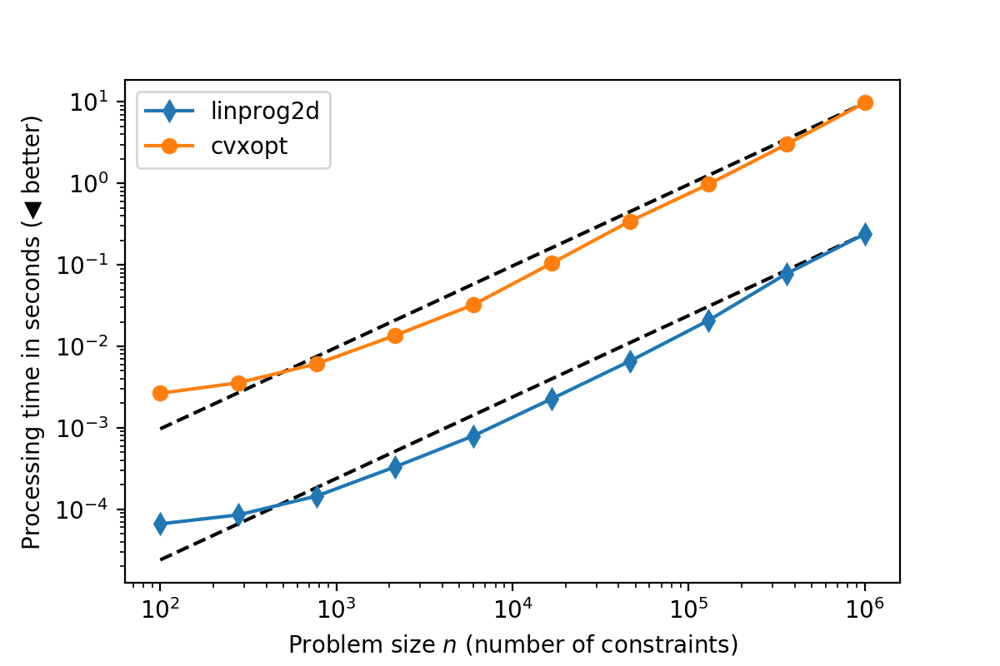

# linprog2d ‒ Linear Programming Solver for 2D Problems

`liblinprog2d` is a small C library for solving two-dimensional linear programming problems in linear time (with respect to the number of constraints). The library can be compiled to JavaScript/WebAssembly and embedded in web applications (4.9kiB gzipped) or called from Python using the provided Python package.

**[Launch interactive demo](https://rawgit.com/astoeckel/linprog2d/master/examples/linprog2d_interactive.html)**.

The code is written in pure C89/C90 and has no dependencies aside from the standard-library functions `sqrt()`, `fabs()`, `malloc()`, and `free()` (heap allocations can be deactivated by defining `LINPROG2D_NO_ALLOC`). To prevent numerical instabilities, the code conditions the input problem (shifts the coordinate system, normalises the constraints) before solving. The library comes with an extensive test-suite (100% line coverage).

## How to use

The library solves a two-dimensional programming problem of the form
```
 minimize cx    * x + cy    * y ,
such that Gx[i] * x + Gy[i] * y >= h[i] for all i ,
```
where `cx`, `cy` are constants defining the gradient of the minimization and `Gx`, `Gy`, `h` define a set of constraints. Goal is to find variables `x` and `y` which fulfill the above constraints.

### C

The following C code demonstrates how to use `linprog2d` to solve a simple problem:

```c
#include <linprog2d.h>
#include <stdio.h>

/* This program maximizes 5 * x + 10 * y such that
          x          >=   0,
                   y >=   0,
          x          <   15,
      8 * x +  8 * y <  160,
      4 * x + 12 * y <  180                         */
int main() {
	/* Input arrays */
	const double Gx[5U] = {1.0, 0.0, -1.0, -8.0, -4.0};
	const double Gy[5U] = {0.0, 1.0, 0.0, -8.0, -12.0};
	const double h[5U] = {0.0, 0.0, -15.0, -160.0, -180.0};

	/* linprog2d_solve_simple allocated memory for the solver, solves the
	   problem, and frees the memory it allocated. linprog2d provides functions
	   that allow to re-use the same memory for multiple problems, as well as
	   functions that allow to perform manual memory management. */
	const double cx = -5.0;
	const double cy = -10.0;
	linprog2d_result_t res =
	    linprog2d_solve_simple(cx, cy, Gx, Gy, h, 5U);

	/* Print the solution */
	if (res.status == LP2D_POINT) {
		printf("x=%0.2f y=%0.2f\n", res.x1, res.y1);
		return 0;
	}
	printf("Problem is infeasible, unbounded, or not a single point.");
	return 1;
}
```

For more information on how to use the library, especially the heap-allocation free version of the library, consult the documentation in the header `linprog2d.h`.

### JavaScript

The following code solves the same problem as the C code above, but uses the JavaScript/WebAssembly library located in the `dist` directoy of this repository (or build it yourself, see below):
```javascript
linprog2d.init().then((solve) => {
	const Gx = [1.0, 0.0,  -1.0,   -8.0,   -4.0];
	const Gy = [0.0, 1.0,   0.0,   -8.0,  -12.0];
	const h  = [0.0, 0.0, -15.0, -160.0, -180.0];
	const res = solve(-5.0, -10.0, Gx, Gy, h);
	if (res.status == linprog2d.POINT) {
		console.log('x =', res.x1, ' y = ', res.y1);
	}
});
```

### Python

Make sure the `liblinprog2d.so` is in your library search path (either by setting the environment variable `LD_LIBRARY_PATH` accordingly or installing `liblinprog2d.so` to `/usr/share/local/lib/`). Install the `linprog2d` Python package by executing the following in the `linprog2d` directory:
```sh
pip3 install .
```
You can use the library as follows:
```python
import linprog2d

Gx = [1.0, 0.0,  -1.0,   -8.0,   -4.0];
Gy = [0.0, 1.0,   0.0,   -8.0,  -12.0];
h  = [0.0, 0.0, -15.0, -160.0, -180.0];
res = linprog2d.solve(-5.0, -10.0, Gx, Gy, h)
if res.status == linprog2d.POINT:
    print("x =", res.x1, "y =", res.y1)
```

## Performance

This library solely solves a special class linear-programming (LP) problems, namely those with only two variables. Correspondingly, it is considerably faster than general LP solvers such as `cvxopt`.



The above image has been generated by the `test_performance.py` script located in the `test` folder. While the time required to solve a problems scales linearly with the number of constraints for both libraries (the dashed line is a linear fit), `linprog2d` is about 40 times faster than the general-purpose solver (this includes the overhead of the Python binding for both solvers). Note that `linprog2d` has not been optimized for performance, but mainly for being (mostly) correct and easy to understand.

## How to build

`liblinprog2d` is written in the C++-compatible subset of C89/C90. So all you need is a standards-compliant C or C++ compiler. Since `liblinprog2d` is just a single source file, building should be fairly straight forward on any platform; just compile `linprog2d.c` or `test/test_linprog2d.c` if you want to execute the unit tests.

### Linux and other Unix-like operating systems

For your convenience, this repository comes with a Makefile that should work on most Unix-like platforms. To build and test `liblinprog2d` just execute the following on your command line:
```sh
git clone https://github.com/astoeckel/linprog2d
cd linprog2d
make && make test
```

### JavaScript/WebAssembly backend

Building the JavaScript/WebAssembly version is a little bit more complicated. You’ll need to install `emsdk`, as well as the `npm` package `babel-minify`. Make sure that the `emsdk` environment is active, then make the `wasm` target by executing the following in the `linprog2d` directory:
```sh
make wasm
```
If you want to run the unit-tests in the JavaScript/WebAssembly version you'll have to install `nodejs`. Execute the following command in the `linprog2d` directory
```sh
emcc test/test_linprog2d.c && node ./a.out.js
```

## References

The following references describe the algorithms used in this library in more detail. The original linear-time 2D linear-programming solver has been proposed by Nimrod Megiddo. It depends on an implementation of the median in linear-time, which is relalized in the code using the "Median-of-medians" selection algorithm proposed by Blum, Floyd, Pratt Rivest, Tarjan.

**Primary resources**
* Nimrod Megiddo. (1983). Linear-Time Algorithms for Linear Programming in R³ and Related Problems. SIAM journal on computing, [PDF](http://epubs.siam.org/doi/pdf/10.1137/0212052)
* Blum, M.; Floyd, R. W.; Pratt, V. R.; Rivest, R. L.; Tarjan, R. E. (1973). Time bounds for selection. Journal of Computer and System Sciences. [PDF](http://people.csail.mit.edu/rivest/pubs/BFPRT73.pdf)

**Secondary resources**
* Sariel Har-Peled. Two dimensional linear programming. [Online](http://sarielhp.org/research/CG/applets/linear_prog/main.html)
* Russel Cohen. My Favorite Algorithm: Linear Time Median Finding. [Online](https://rcoh.me/posts/linear-time-median-finding/)
* Eduardo Sany Laber. Selection in Linear Time. [Presentation, PDF](http://www-di.inf.puc-rio.br/~laber/median-lineartime.pdf)

## License

```
linprog2d --- Two-dimensional linear programming solver
Copyright (C) 2018 Andreas Stöckel

This program is free software: you can redistribute it and/or modify
it under the terms of the GNU General Public License as published by
the Free Software Foundation, either version 3 of the License, or
(at your option) any later version.

This program is distributed in the hope that it will be useful,
but WITHOUT ANY WARRANTY; without even the implied warranty of
MERCHANTABILITY or FITNESS FOR A PARTICULAR PURPOSE.  See the
GNU General Public License for more details.

You should have received a copy of the GNU General Public License
along with this program.  If not, see <https://www.gnu.org/licenses/>.
```

